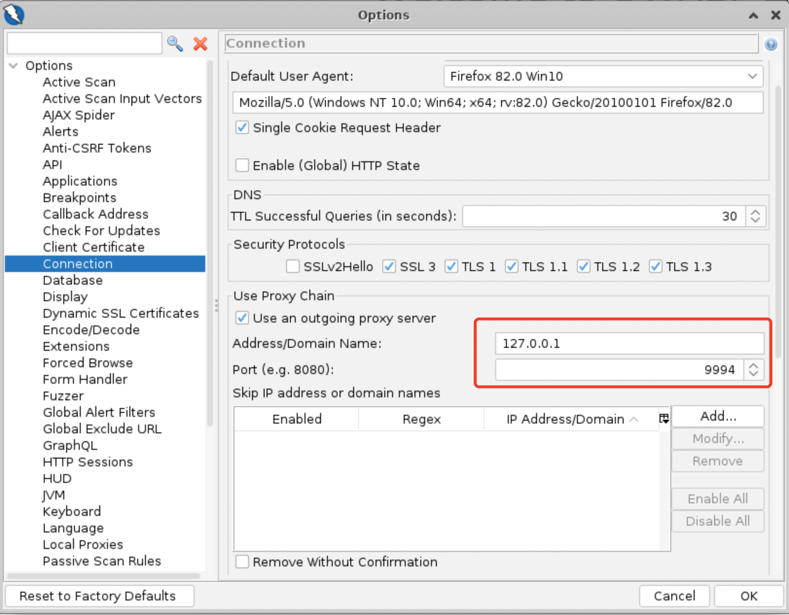

# Scanner++

Scanner++ is an enhanced framework that improves web vulnerability detection of existing base scanners with attack intent synchronization.

## Demonstration about Benchmark Applications

The basic statistics about benchmark applications are as follows. Note that the last three applications are currently used in the company CCDC (China Central Depository & Clearing Co., LTD), and we were unable to get the source code to upload to this repository. 

| Abbr. |             Project Name             |                Language                |
| :---: | :----------------------------------: | :------------------------------------: |
|  SEA  |                SeaCMS                |    PHP, JavaScript, CSS, HTML, XML     |
|  SCH  |              SchoolMate              |       PHP, HTML, CSS, JavaScript       |
|  MYB  |              myBloggle               |       PHP, CSS, XML, JavaScript        |
|  OSC  |              osCommerce              | PHP, JavaScript, CSS, HTML, JavaScript |
|  GEC  |              geccbblite              |       PHP, CSS, HTML, JavaScript       |
|  ELE  |               Elemata                |    PHP, JavaScript, CSS, HTML, XML     |
|  WAC  |              Wackopicko              |       PHP, CSS, HTML, JavaScript       |
|  WCH  |               WebChess               |       PHP, JavaScript, CSS, HTML       |
|  SCR  |                SCARF                 |       PHP, CSS, HTML, JavaScript       |
|  FAQ  |               FAQforge               |       PHP, CSS, HTML, JavaScript       |
| CBIN  |    China Bond Information Network    |      Java, CSS, HTML, JavaScript       |
| BIRS  | Bank Information Registration System |      Java, CSS, HTML, JavaScript       |
| BIDS  | Bond Information Disclousure System  |      Java, CSS, HTML, JavaScript       |

Benchmark applications is available [here](https://github.com/ScannerPlusPlus/ScannerPlusPlus/blob/main/BenchmarkWebsites.zip).

# Scanner++ Evaluation

## Deployment of Benchmark Applications

We recommend you use Linux+Nginx+MySQL to deploy benchmark applications uploaded in this repository. The recommended PHP version is 5.6, and the MySQL version is 5.6.50. 

The database information needed by benchmark sites is uploaded in the file "`BenchmarkDatabaseStructure.zip`". You should load the database file into your MySQL first, then try to test against the website.

The default account configuration used by benchmark applications is `root/root`. You can also modify the corresponding configuration files in the benchmark websites based on your own need.  

## Scanner++ Usage

The needed parameters are as follows:

- Scanner Name: BurpSuite/ZAP/AWVS/Arachni. Note that other scanners can also be enhanced with Scanner++, and the only difference is that it requires the user to start the scanner manually.
- Site Name: Optional. If the user specifies the site name, it will be noted in the corresponding record in the "scanner_cnt" table of the database for statistical purposes.
- Enable Enhance: 0/1 means turn on/off the enhancement.
- Port: The proxy port you want to bind. Note that this port should also be configured in the base scanners.
- Mode: normal/novector/norefine. The first mode will start Scanner++ normally. The second mode will cause Scanner++ to start in a manner where only the attack surface is shared, and no attack vectors are shared. The third will cause Scanner++ not to use the attack vectors obtained by the refinement algorithm.

Scanner++ needs to work with the database structure stored in scandata.sql. Please import it first, and then start Scanner++. After Scanner++ succesfully binded the port specified above, you can use base scanners to test against the target website. 

The only thing that requires special configuration of the base scanners to work with Scanner++ is its proxy settings. For BurpSuite, the configuration is located in the `User Options` - `Upstream Proxy Servers`. Note that the `Proxy` setting on the top is used to intercept packets, and is not used in Scanner++.

Proxy settings for AWVS can be specified when creating a test target. The configuration of the HTTP proxy can be seen in the `Targets`-`Add Target`-`Proxy Server`.

For ZAP, the proxy settings are located in the `Tools`-`Options...`-`Connection`:

For Arachni, you need to modify the default profile in the `Profiles`-`Default`-`Modify`:

For multiple scanners, you can run Scanner++ on different port, and set the corresponding scanner with the port configured in the command line. During Scanning, Scanner++ will show the real time request information:

If you have configured the site name, then scanning statistics, including the scanner name, site name, timestamp of the scanning start and end time, the number of POST and GET request packets, will be shown in the table scanner_cnt. The detected vulnerabilities will be reported in base scanners.
